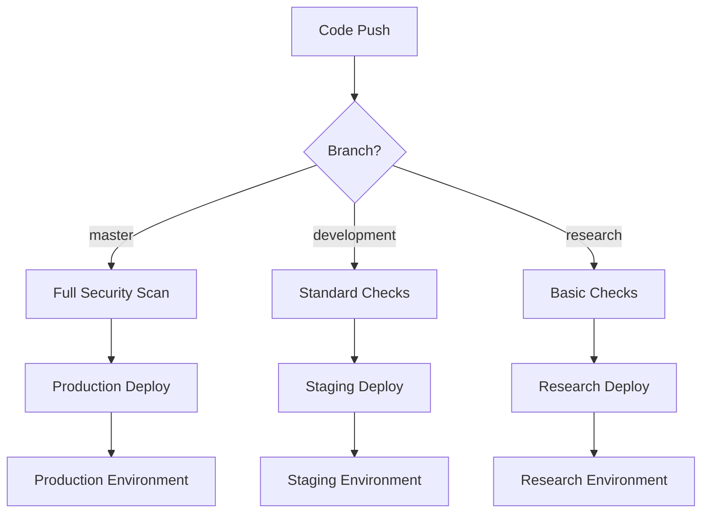

# Wasm Wizard Deployment Strategy

## Branch Structure

### 🚀 Master Branch (Production)
- **Purpose:** Production-ready code
- **Environment:** Production
- **Auto-deploy:** Yes (after all checks pass)
- **Docker Tag:** `latest`
- **Protection:** Maximum security

### 🧪 Development Branch (Staging)
- **Purpose:** Integration testing and staging
- **Environment:** Staging
- **Auto-deploy:** Yes
- **Docker Tag:** `staging`
- **Protection:** High security

### 🔬 Research Branch (Experimental)
- **Purpose:** Experimental features and research
- **Environment:** Development
- **Auto-deploy:** Yes
- **Docker Tag:** `research`
- **Protection:** Moderate security

## CI/CD Pipeline Flow



## Deployment Environments

### Production Environment
- **URL:** `https://wasm-wizard.com` (when configured)
- **Infrastructure:** Kubernetes cluster with HA
- **Database:** PostgreSQL with backup/replication
- **Redis:** Clustered for high availability
- **Monitoring:** Full Prometheus/Grafana stack
- **SSL:** Full TLS with security headers
- **Scaling:** Auto-scaling based on metrics

### Staging Environment
- **URL:** `https://staging.wasm-wizard.com` (when configured)
- **Infrastructure:** Single Kubernetes node or Docker Compose
- **Database:** PostgreSQL (smaller instance)
- **Redis:** Single instance
- **Monitoring:** Basic Prometheus metrics
- **SSL:** TLS enabled
- **Purpose:** Integration testing, user acceptance

### Research Environment
- **URL:** `https://research.wasm-wizard.com` (when configured)
- **Infrastructure:** Docker Compose or local deployment
- **Database:** PostgreSQL (development)
- **Redis:** Single instance
- **Monitoring:** Basic health checks
- **SSL:** Optional
- **Purpose:** Feature development, experiments

## Security Levels by Branch

### Master (Production) - Maximum Security
✅ **Required Checks:**
- Security audit (fails on HIGH/CRITICAL vulnerabilities)
- Code formatting validation
- Complete test suite (85%+ coverage)
- Docker container security scan
- Performance benchmarks
- Documentation updates

✅ **Manual Reviews:**
- 2 required reviewers
- Code owner approval
- Security team review for infrastructure changes
- Architecture review for major changes

### Development (Staging) - High Security
✅ **Required Checks:**
- Security audit (allows known LOW/MEDIUM issues)
- Code formatting validation
- Complete test suite
- Docker container scan
- Integration tests

✅ **Manual Reviews:**
- 1 required reviewer
- Automated merge after approval

### Research (Experimental) - Moderate Security
✅ **Required Checks:**
- Basic security audit
- Code formatting validation
- Core test suite
- Basic Docker scan

✅ **Manual Reviews:**
- Optional (can direct push for rapid iteration)
- Self-review acceptable

## Deployment Commands

### Production Deployment (Kubernetes)
```bash
# Apply production configuration
kubectl apply -f k8s/production/

# Rolling update
kubectl set image deployment/wasm-wizard wasm-wizard=wasm-wizard:latest

# Monitor rollout
kubectl rollout status deployment/wasm-wizard
```

### Staging Deployment (Docker Compose)
```bash
# Deploy to staging
docker-compose -f docker-compose.staging.yml up -d

# Update image
docker-compose -f docker-compose.staging.yml pull
docker-compose -f docker-compose.staging.yml up -d --no-deps wasm-wizard
```

### Research Deployment (Local)
```bash
# Quick local deployment
docker-compose -f docker-compose.dev.yml up -d

# Or run directly
cargo run
```

## Environment Variables by Branch

### Production
```env
ENVIRONMENT=production
AUTH_REQUIRED=true
RUST_LOG=info
DATABASE_URL=postgres://prod_user@prod_host/wasm-wizard
REDIS_URL=redis://prod-redis-cluster
SSL_CERT_PATH=/etc/ssl/certs/wasm-wizard.crt
```

### Staging
```env
ENVIRONMENT=staging
AUTH_REQUIRED=true
RUST_LOG=debug
DATABASE_URL=postgres://staging_user@staging_host/wasm-wizard_staging
REDIS_URL=redis://staging-redis
SSL_CERT_PATH=/etc/ssl/certs/staging.crt
```

### Research
```env
ENVIRONMENT=development
AUTH_REQUIRED=false
RUST_LOG=trace
DATABASE_URL=postgres://dev_user@localhost/wasm-wizard_dev
REDIS_URL=redis://localhost:6379
```

## Rollback Procedures

### Production Rollback
```bash
# Quick rollback to previous version
kubectl rollout undo deployment/wasm-wizard

# Rollback to specific revision
kubectl rollout undo deployment/wasm-wizard --to-revision=2

# Verify rollback
kubectl rollout status deployment/wasm-wizard
```

### Database Migrations
- All migrations are forward-only
- Rollback requires manual intervention
- Backup taken before each deployment

## Monitoring & Alerts

### Production Monitoring
- **Uptime monitoring:** 99.9% SLA
- **Performance alerts:** >200ms response time
- **Security alerts:** Failed authentication attempts
- **Resource alerts:** CPU/Memory/Disk usage

### Staging Monitoring
- **Basic uptime checks**
- **Error rate monitoring**
- **Performance baselines**

### Research Monitoring
- **Health check endpoints**
- **Basic error logging**

## Release Process

### 1. Feature Development
```bash
# Create feature branch from development
git checkout development
git pull origin development
git checkout -b feature/new-feature

# Develop and test
# Push to research for experimental testing
git push origin research
```

### 2. Integration Testing
```bash
# Merge to development for staging
git checkout development
git merge feature/new-feature
git push origin development

# Automated deployment to staging
# Manual testing in staging environment
```

### 3. Production Release
```bash
# Create release PR to master
git checkout master
git merge development
git tag v1.x.x
git push origin master --tags

# Automated deployment to production
# Monitor deployment and metrics
```

## Emergency Procedures

### Hotfix Process
```bash
# Create hotfix branch from master
git checkout master
git checkout -b hotfix/critical-fix

# Apply minimal fix
# Emergency deployment process
git checkout master
git merge hotfix/critical-fix
git push origin master

# Backport to development
git checkout development
git cherry-pick <hotfix-commit>
git push origin development
```

### Incident Response
1. **Immediate:** Rollback to last known good version
2. **Short-term:** Apply hotfix if rollback not sufficient
3. **Long-term:** Root cause analysis and prevention
4. **Follow-up:** Update monitoring and alerting

## Quality Gates

All environments enforce these standards:
- ✅ Zero high/critical security vulnerabilities in production
- ✅ 85%+ test coverage maintained
- ✅ All tests passing
- ✅ Code formatted and linted
- ✅ Docker containers scanned for vulnerabilities
- ✅ Performance benchmarks within acceptable ranges

This strategy ensures reliable, secure, and maintainable deployments across all environments while allowing for rapid development and experimentation.