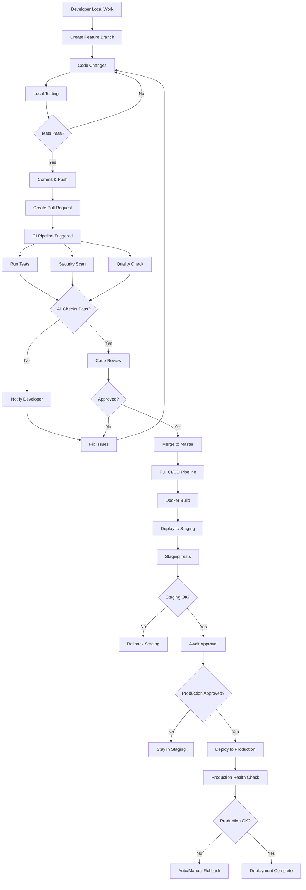
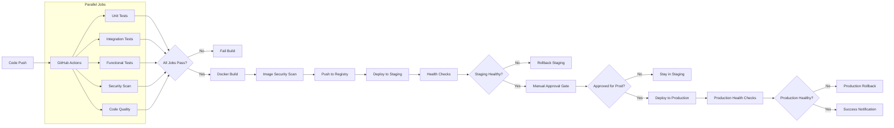
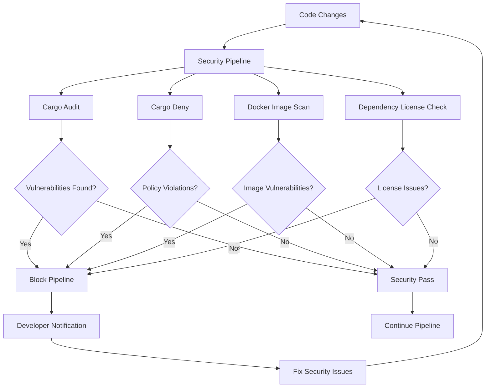
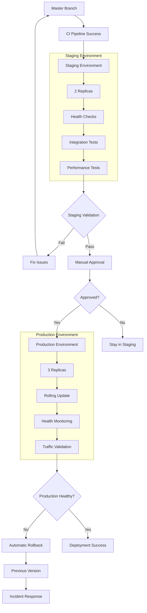
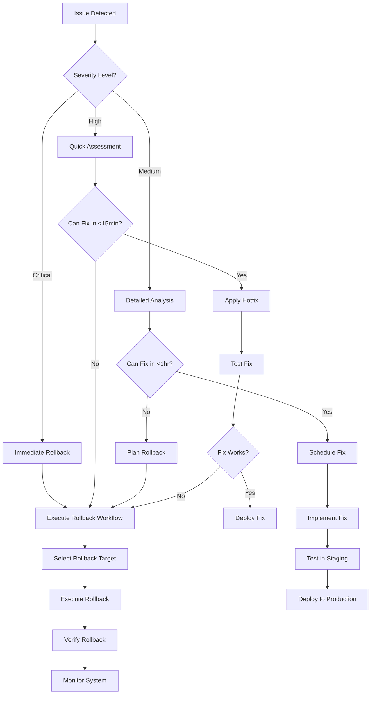
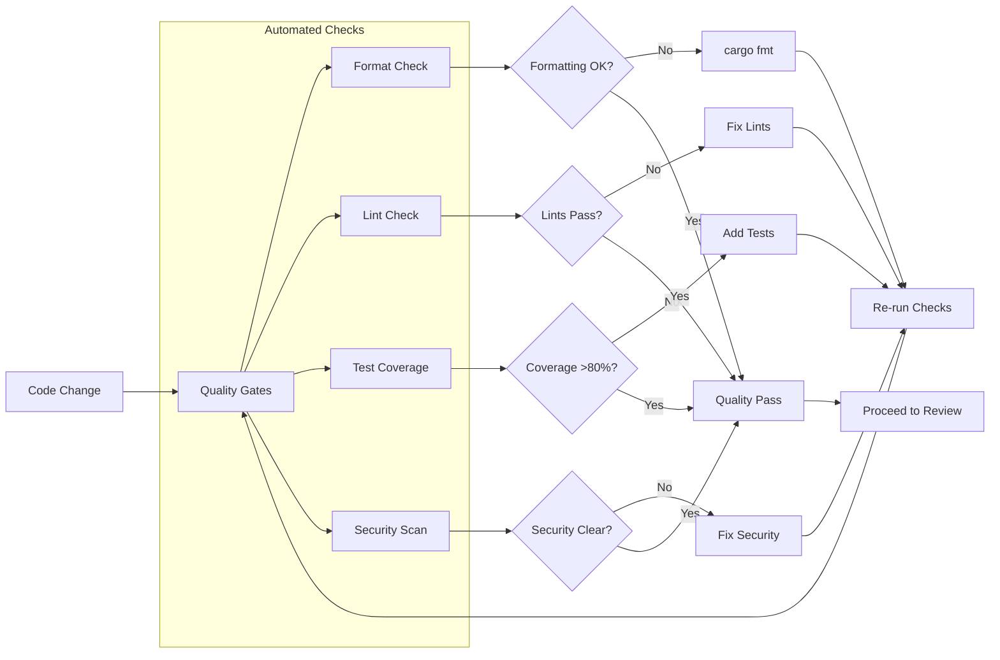
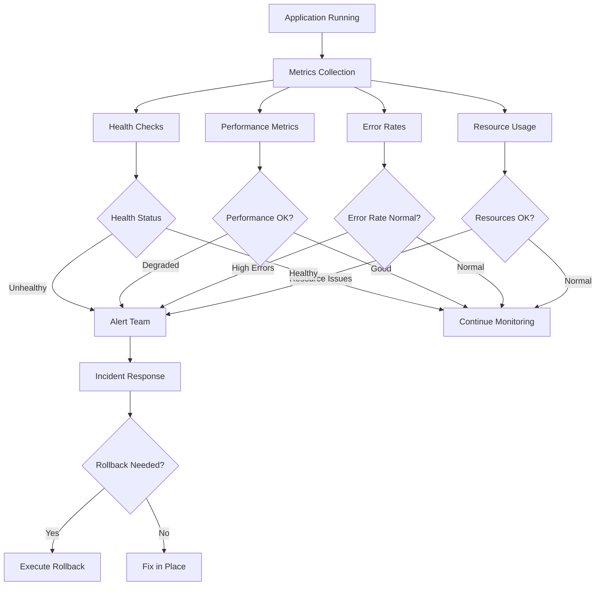
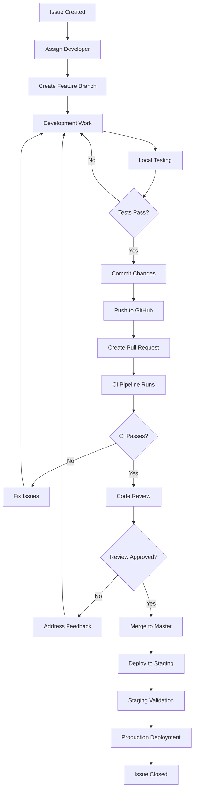

# Git Workflow Visual Diagrams

**WasmWiz Project Workflow Visualization**  
**Created:** June 20, 2025

## Complete Workflow Overview



## Branch Flow Diagram

```mermaid
gitgraph
    commit id: "Initial"
    branch feature/auth
    checkout feature/auth
    commit id: "Add auth middleware"
    commit id: "Add tests"
    checkout main
    merge feature/auth
    commit id: "Deploy v1.1"
    branch hotfix/security
    checkout hotfix/security
    commit id: "Fix security issue"
    checkout main
    merge hotfix/security
    commit id: "Deploy v1.1.1"
    branch feature/api
    checkout feature/api
    commit id: "New API endpoint"
    commit id: "Update docs"
    checkout main
    merge feature/api
    commit id: "Deploy v1.2"
```

## CI/CD Pipeline Detailed Flow



## Security Scanning Flow



## Deployment Strategy Visualization



## Rollback Decision Tree



## Quality Gate Process



## Monitoring and Alerting Flow



## Development Lifecycle



---

## Usage Instructions

These diagrams illustrate the complete workflow for the WasmWiz project. They can be:

1. **Embedded in Documentation**: Copy the mermaid code into markdown files
2. **Rendered in GitHub**: GitHub automatically renders mermaid diagrams
3. **Used in Presentations**: Export as images for team presentations
4. **Training Materials**: Help new team members understand the process

## Diagram Tools

- **Mermaid**: Used for all diagrams above
- **GitHub**: Automatically renders mermaid in markdown
- **VS Code**: Mermaid preview extension available
- **Online Editor**: https://mermaid.live/ for editing

---

**Maintenance**: Update these diagrams when workflow changes are made.  
**Location**: `DOCS/GIT_WORKFLOW_DIAGRAMS.md`
