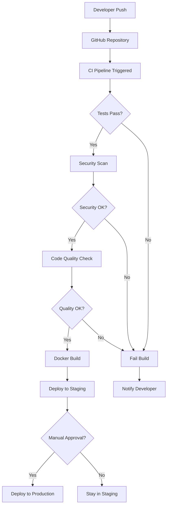

# Git Workflow Guide for WasmWiz

**Project:** WasmWiz - WebAssembly Execution Platform  
**Document Version:** 1.0  
**Last Updated:** June 20, 2025  
**Target Audience:** Developers, DevOps Engineers, Project Maintainers

## Table of Contents

1. [Overview](#overview)
2. [Workflow Architecture](#workflow-architecture)
3. [Branch Strategy](#branch-strategy)
4. [Development Workflow](#development-workflow)
5. [CI/CD Pipeline Details](#cicd-pipeline-details)
6. [Deployment Process](#deployment-process)
7. [Rollback Procedures](#rollback-procedures)
8. [Best Practices](#best-practices)
9. [Troubleshooting](#troubleshooting)
10. [Quick Reference](#quick-reference)

## Overview

The WasmWiz project uses a **Git-based CI/CD workflow** powered by GitHub Actions. This workflow ensures code quality, security, and reliable deployments through automated testing, security scanning, and staged deployment processes.

### Key Components

- **Git Repository**: Source code version control
- **GitHub Actions**: CI/CD automation platform
- **Docker**: Containerization and deployment
- **Kubernetes**: Container orchestration
- **Security Scanning**: Multiple vulnerability detection layers

## Workflow Architecture



## Branch Strategy

### Main Branches

#### `master` (Primary Branch)
- **Purpose**: Production-ready code
- **Protection**: Protected branch with required status checks
- **Deployment**: Automatically triggers CI/CD pipeline
- **Access**: Push access restricted to maintainers

#### `develop` (Integration Branch) - *[Recommended Future Addition]*
- **Purpose**: Integration of completed features
- **Protection**: Requires PR reviews
- **Testing**: Full test suite runs on all pushes

#### Feature Branches
- **Naming Convention**: `feature/description` or `feature/ISSUE-123`
- **Lifecycle**: Created from `master`, merged back via PR
- **Cleanup**: Deleted after successful merge

#### Hotfix Branches
- **Naming Convention**: `hotfix/description` or `hotfix/ISSUE-123`
- **Purpose**: Critical production fixes
- **Process**: Fast-track to production with immediate deployment

## Development Workflow

### 1. Starting New Work

```bash
# 1. Ensure you're on master and up to date
git checkout master
git pull origin master

# 2. Create a new feature branch
git checkout -b feature/your-feature-name

# 3. Make your changes
# ... code changes ...

# 4. Stage and commit changes
git add .
git commit -m "feat: Add new feature description

- Bullet point 1
- Bullet point 2
- Fixes #123"
```

### 2. Pushing and Creating Pull Request

```bash
# 1. Push your branch
git push origin feature/your-feature-name

# 2. Create Pull Request via GitHub UI
# - Add descriptive title and description
# - Link related issues
# - Request reviewers
# - Add labels if applicable
```

### 3. Pull Request Process

1. **Automated Checks**: CI pipeline runs automatically
2. **Code Review**: Team members review changes
3. **Updates**: Address feedback and push updates
4. **Approval**: Get required approvals
5. **Merge**: Merge to master (triggers deployment)

## CI/CD Pipeline Details

### Automatic Triggers

The CI/CD pipeline (`ci.yml`) automatically triggers on:

```yaml
on:
  push:
    branches: [ master ]
  pull_request:
    branches: [ master ]
```

### Pipeline Stages

#### Stage 1: Testing (Parallel Execution)
- **Unit Tests**: Core functionality validation
- **Integration Tests**: Database and service integration
- **Functional Tests**: End-to-end scenario testing

```bash
# What happens:
cargo test --all-features --verbose
# 41 tests must pass for pipeline to continue
```

#### Stage 2: Security Scanning (Parallel Execution)
- **Dependency Audit**: Known vulnerability scanning
- **License Compliance**: Dependency license verification

```bash
# What happens:
cargo audit
cargo deny check
```

#### Stage 3: Code Quality (Parallel Execution)
- **Formatting Check**: Rust code formatting validation
- **Linting**: Clippy static analysis

```bash
# What happens:
cargo fmt -- --check
cargo clippy --all-targets --all-features -- -D warnings
```

#### Stage 4: Docker Build
- **Multi-stage Build**: Optimized container creation
- **Security Scanning**: Container vulnerability assessment
- **Registry Push**: Image pushed to container registry

#### Stage 5: Staging Deployment
- **Automatic**: Deploys to staging on successful CI
- **Environment**: Kubernetes staging namespace
- **Validation**: Health checks and smoke tests

#### Stage 6: Production Deployment
- **Manual Approval Required**: Human gate for production
- **Environment**: Kubernetes production namespace
- **Validation**: Comprehensive health checks

### Pipeline Configuration

The pipeline is defined in `.github/workflows/ci.yml`:

```yaml
name: CI/CD Pipeline

on:
  push:
    branches: [ master ]
  pull_request:
    branches: [ master ]

jobs:
  test:
    runs-on: ubuntu-latest
    steps:
      - uses: actions/checkout@v4
      - name: Install Rust
        uses: dtolnay/rust-toolchain@stable
      - name: Run tests
        run: cargo test --all-features --verbose
```

## Deployment Process

### Staging Deployment

**Trigger**: Automatic on successful CI pipeline completion

**Process**:
1. Docker image is built and pushed
2. Kubernetes deployment is updated
3. Health checks verify deployment
4. Smoke tests validate functionality

**Access**: Internal staging environment

**Validation**:
```bash
# Health check
curl https://staging.wasmwiz.example.com/health

# Functionality test
curl -X POST https://staging.wasmwiz.example.com/api/execute \
  -H "Content-Type: application/json" \
  -d '{"wasm_code": "...", "input": "test"}'
```

### Production Deployment

**Trigger**: Manual approval after successful staging deployment

**Approval Process**:
1. Navigate to GitHub Actions
2. Find the completed workflow run
3. Click "Review deployments"
4. Select "production" environment
5. Click "Approve and deploy"

**Process**:
1. Production Kubernetes deployment updated
2. Rolling update performed (zero downtime)
3. Health checks verify deployment
4. Full functionality validation

**Monitoring**: Production metrics and alerts active

## Rollback Procedures

### Automatic Rollback Triggers

The system will automatically consider rollback if:
- Health checks fail after deployment
- Error rates exceed threshold (>5%)
- Response times degrade significantly

### Manual Rollback Process

**Trigger**: Use the rollback workflow in GitHub Actions

**Steps**:
1. Navigate to GitHub Actions
2. Select "Manual Rollback" workflow
3. Click "Run workflow"
4. Specify:
   - Environment (staging/production)
   - Target version/commit
   - Reason for rollback

**Rollback Workflow** (`.github/workflows/rollback.yml`):
```yaml
name: Manual Rollback

on:
  workflow_dispatch:
    inputs:
      environment:
        description: 'Environment to rollback'
        required: true
        type: choice
        options:
        - staging
        - production
      version:
        description: 'Version/commit to rollback to'
        required: true
        type: string
```

### Rollback Validation

After rollback:
1. **Health Checks**: Verify service is healthy
2. **Functionality Tests**: Confirm core features work
3. **Monitoring**: Check metrics and logs
4. **Communication**: Notify team of rollback completion

## Best Practices

### Commit Messages

Use conventional commit format:

```
type(scope): description

body (optional)

footer (optional)
```

**Types**:
- `feat`: New feature
- `fix`: Bug fix
- `docs`: Documentation
- `style`: Code style changes
- `refactor`: Code refactoring
- `test`: Test additions/changes
- `chore`: Maintenance tasks

**Examples**:
```
feat(auth): add JWT token validation

Add middleware to validate JWT tokens on protected routes.
Includes rate limiting and proper error handling.

Fixes #123
```

### Branch Naming

```
feature/add-user-authentication
feature/ISSUE-123-fix-memory-leak
hotfix/security-vulnerability-fix
docs/update-api-documentation
```

### Pull Request Guidelines

**Title**: Clear, descriptive summary
**Description**: Include:
- What changes were made
- Why the changes were necessary
- How to test the changes
- Any breaking changes
- Related issue numbers

**Template**:
```markdown
## Description
Brief description of changes

## Type of Change
- [ ] Bug fix
- [ ] New feature
- [ ] Breaking change
- [ ] Documentation update

## Testing
- [ ] Unit tests pass
- [ ] Integration tests pass
- [ ] Manual testing completed

## Checklist
- [ ] Code follows style guidelines
- [ ] Self-review completed
- [ ] Documentation updated
```

### Code Quality Standards

**Before Committing**:
```bash
# Format code
cargo fmt

# Run lints
cargo clippy --all-targets --all-features -- -D warnings

# Run tests
cargo test

# Check for security vulnerabilities
cargo audit
```

### Security Considerations

**Secrets Management**:
- Never commit secrets to repository
- Use GitHub Secrets for sensitive data
- Rotate secrets regularly
- Use least privilege access

**Dependency Management**:
- Regularly update dependencies
- Monitor security advisories
- Use `cargo-deny` for compliance
- Review dependency licenses

## Troubleshooting

### Common Issues and Solutions

#### 1. CI Pipeline Failures

**Test Failures**:
```bash
# Run tests locally
cargo test --all-features --verbose

# Run specific test
cargo test test_name

# Run with output
cargo test -- --nocapture
```

**Formatting Issues**:
```bash
# Fix formatting
cargo fmt

# Check formatting
cargo fmt -- --check
```

**Lint Failures**:
```bash
# Fix common issues
cargo clippy --fix

# Check without fixing
cargo clippy --all-targets --all-features -- -D warnings
```

#### 2. Deployment Issues

**Staging Deployment Fails**:
1. Check GitHub Actions logs
2. Verify Kubernetes cluster status
3. Check Docker image build logs
4. Validate Kubernetes manifests

**Production Approval Missing**:
1. Ensure staging deployment succeeded
2. Check approval permissions
3. Verify environment configuration

#### 3. Rollback Issues

**Rollback Fails**:
1. Check target version exists
2. Verify rollback permissions
3. Check deployment history
4. Manual kubectl rollback if needed:

```bash
kubectl rollout undo deployment/wasmwiz -n wasmwiz-production
```

### Getting Help

**Log Analysis**:
```bash
# GitHub Actions logs
# Navigate to Actions tab → Select workflow run → View logs

# Kubernetes logs
kubectl logs -f deployment/wasmwiz -n wasmwiz-production

# Application logs
kubectl logs -l app=wasmwiz -n wasmwiz-production --tail=100
```

**Health Checks**:
```bash
# Check deployment status
kubectl get deployments -n wasmwiz-production

# Check pod status
kubectl get pods -n wasmwiz-production

# Check service status
kubectl get services -n wasmwiz-production
```

## Quick Reference

### Essential Commands

```bash
# Start new feature
git checkout master && git pull && git checkout -b feature/name

# Commit changes
git add . && git commit -m "feat: description"

# Push and create PR
git push origin feature/name

# Update from master
git checkout master && git pull && git checkout feature/name && git merge master

# Clean up after merge
git checkout master && git pull && git branch -d feature/name
```

### GitHub Actions URLs

- **All Workflows**: `https://github.com/your-org/wasmwiz/actions`
- **CI Pipeline**: `https://github.com/your-org/wasmwiz/actions/workflows/ci.yml`
- **Rollback**: `https://github.com/your-org/wasmwiz/actions/workflows/rollback.yml`

### Environment URLs

- **Staging**: `https://staging.wasmwiz.example.com`
- **Production**: `https://wasmwiz.example.com`
- **Health Check**: `/health`
- **Readiness Check**: `/ready`

### Key Files

```
.github/workflows/
├── ci.yml              # Main CI/CD pipeline
└── rollback.yml        # Manual rollback workflow

k8s/
├── staging-deployment.yaml     # Staging configuration
├── production-deployment.yaml  # Production configuration
└── namespaces-and-secrets.yaml # Security setup

deny.toml               # Dependency scanning config
rustfmt.toml           # Code formatting config
```

### Status Badges

Add to README.md:
```markdown


```

---

## Summary

This Git workflow provides:

✅ **Automated Quality Assurance**: Every change is tested and validated  
✅ **Security-First Approach**: Multiple layers of security scanning  
✅ **Reliable Deployments**: Staged rollouts with approval gates  
✅ **Quick Recovery**: Automated and manual rollback capabilities  
✅ **Full Traceability**: Complete audit trail of all changes  

The workflow balances automation with control, ensuring high-quality, secure deployments while maintaining developer productivity.

**For questions or support**, refer to the project documentation or contact the development team.

---

**Document Maintenance**: This guide should be updated whenever workflow changes are made.  
**Next Review**: Every 3 months or after major workflow changes.
